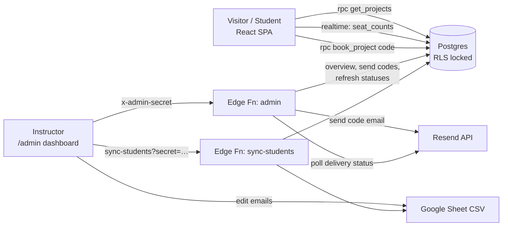
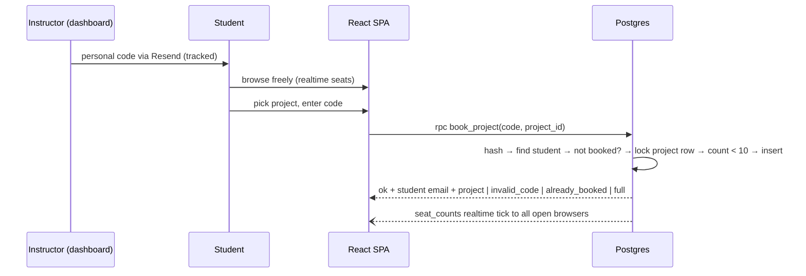

# PRD, Humble Coders Project Booking

**Status:** v2 spec, decisions locked (see Decision Log) · **Owner:** Humble Coders (instructor) · **Date:** 2026-08-17

---

## 1. Overview & Vision

A single-page website, themed to match [humblecoders.in](https://humblecoders.in), where application-development students pick **one of 25 beginner-level Android project ideas**, each built around a freely available public API consumed with Retrofit, and book it for themselves.

The instructor needs seat scarcity (max **10 students per project**) enforced honestly: when many students race for the same project at once, exactly the first 10 win and everyone else gets a clean "full" message. Students are verified **without any login/auth system**: each registered student receives a **personal booking code** by email (sent by the instructor from the admin dashboard). At booking time the student enters only that code, the system knows who they are from it. Browsing is completely open, with **realtime** seat counts.

**Success looks like:** every student books exactly one project with zero instructor intervention beyond distributing codes, no double-bookings, no overbooked projects, and no disputes about who got a seat.

## 2. Goals & Non-Goals

### Goals (v1)
- Browse all 25 projects, no code or email needed to look. Title, brief description, API name + link, key badge, and **live seats-left counts that update in realtime** as others book.
- Book a project by entering **only your personal code**, the system identifies the student and confirms the seat in one step.
- Hard limits enforced server-side: **10 seats per project**, **1 booking per student**, race-condition safe.
- **Admin dashboard (very basic)** for the instructor:
  - see which student has booked which project;
  - see the delivery status of every code email (sent / delivered / bounced / failed);
  - send codes (individually or "all pending") and **resend on request**, a resend generates a **new code that always works and immediately invalidates the old one**.
- Registered-students list maintained in a **Google Sheet**, synced into the system.

### Non-Goals (v1)
- No accounts, passwords, sessions, or OAuth of any kind, for students **or** instructor (dashboard is gated by a single admin secret).
- No student self-service cancel/switch (instructor deletes a booking row to free a seat).
- No booking window/deadline logic (open decision, out of v1).
- No payment, waitlists, teams, or multi-course support.
- Site never sends email, all sending happens from the dashboard.

## 3. Users & Roles

| Role | Who | What they do | How they're identified |
|---|---|---|---|
| Visitor | Anyone | Browses the catalogue, sees live seat counts | Nobody, browsing is open |
| Student | Registered course member | Books exactly one project | Possession of their personal booking code |
| Instructor | Humble Coders staff | Sends/resends codes, monitors delivery, sees bookings; maintains email list (Google Sheet) | Admin secret (dashboard); `SYNC_SECRET` (sheet sync) |

## 4. System Architecture

**Stack (locked):** **Vite + React + TypeScript + Tailwind CSS** single-page app with two routes, public catalogue `/` and admin dashboard `/admin`, static build deployed at `projects.humblecoders.in` + **Supabase free tier** (Postgres, RLS, Edge Functions, Realtime) + **Resend** (code emails, sent from dashboard only) + **Google Sheet published as CSV** (registered-email source of truth). A vanilla-JS prototype exists at `project-booking/index.html` as the **visual** baseline (its email+OTP flow is superseded by this spec).

### Data model

| Table | Columns | Notes |
|---|---|---|
| `students` | `email` PK, `code_hash` **unique**, `code_sent_at`, `resend_email_id`, `delivery_status` (`none`/`sent`/`delivered`/`bounced`/`failed`), `added_at` | One active code per student; hash only, never plaintext. Upserted from the Google Sheet |
| `projects` | `id` PK, `title`, `description`, `api_name`, `api_url`, `api_note`, `capacity` (default 10) | Seeded with the 25 ideas |
| `bookings` | `id`, `email` **unique** FK→students, `project_id` FK→projects, `booked_at` | Unique email = one booking per student |
| `seat_counts` | `project_id` PK, `booked` int | Maintained by trigger on `bookings`; the **only** table with an anon SELECT policy (aggregate numbers only), powers Supabase Realtime |

The v1 `otps` table is gone, codes are persistent per student, not per-booking.

### Booking codes
- Format: **6 characters, A–Z + 2–9 excluding ambiguous (no 0/O/1/I)**, e.g. `7FK3Q9`; case-insensitive on entry; unique across students (~700M space, unguessable at classroom scale, easy to type from a phone).
- Generated only by the admin `send_code` action; stored as SHA-256 hash; emailed via Resend.
- **Resend = replace**: generating a new code overwrites `code_hash`, so the newest emailed code always works and the previous one instantly stops working.

### Security model (no auth, still safe)
- **RLS on with zero policies** on `students`, `projects`, `bookings` → anon key reads/writes nothing directly. `seat_counts` alone has an anon SELECT policy (safe: two integers per project).
- Public API surface is exactly: `get_projects()`, `book_project(code, project_id)` (both `SECURITY DEFINER`), and the realtime subscription on `seat_counts`.
- Admin surface is one edge function requiring the `ADMIN_SECRET` header; the dashboard route holds no privileged logic itself.
- A booking requires a valid code → possession of the student's inbox at distribution time; codes are revocable by resend.

### Race-condition guarantee (the core correctness requirement)
`book_project` takes `SELECT … FOR UPDATE` on the project row **before** counting seats, serializing all concurrent bookings for that project inside Postgres. 15 simultaneous confirms → exactly 10 inserts, 5 clean `full` errors. The one-booking rule is a DB unique constraint, so it cannot be raced either. **Any reimplementation must preserve these two properties.**

### Booking flow

## 5. Feature Spec by Area

### 5.1 Project catalogue (public, `/`)
- Hero: "Pick Your API Project" + stat pills (25 projects / 10 seats each / 1 per student), dark theme with humblecoders.in tokens (bg `#07090f`, card `#0f131c`, brand `#4263a6`/`#5b7cc4`, gold `#f5c451`, Inter, radius `.875rem`), actual humblecoders.in logo.
- Card per project: `Project NN` chip, key badge (green "No key needed" / gold "Free API key"), title, 1–2 line description, API link (new tab), seat progress bar + "N seats left" (amber ≤3, red/disabled at 0), Book button ("Fully Booked" disabled when full).
- **Seat counts update in realtime** via Supabase Realtime on `seat_counts` (no refresh needed while students race); polling fallback (~45 s) if the channel drops.
- Fully responsive; works down to 375 px.

### 5.2 Booking modal (code-only)
- **Step 1:** the only input, the student's personal code (6 chars, auto-uppercase) → "Confirm Booking" → `rpc book_project`.
- **Step 2 (result):** success shows **who they are** (their email) + the booked project; errors map to friendly copy:
  `invalid_code` ("check the code from your email, or ask your instructor to resend") · `already_booked` (+which project they hold) · `full` (seat just taken, counts refresh) · `no_project`.
- Cosmetic "You've booked X" banner from localStorage (server state is the truth).

### 5.3 Admin dashboard (`/admin`, very basic, one page)
- Gate: admin secret entered once (kept in localStorage), sent as `x-admin-secret` header to the `admin` edge function. Wrong secret → locked out message.
- **Students table:** email · booked project (or,) · code sent at · **delivery status chip** (none/sent/delivered/bounced/failed) · per-row **Send / Resend code** button.
- **Toolbar:** "Send codes to all pending" (students with no code yet) · "Refresh delivery statuses" (polls Resend per tracked email id) · "Sync sheet" · live totals (booked / unbooked / codes delivered).
- **Projects summary:** per project, seats taken + the booked students' emails.
- Resend semantics (the "new code always works" rule): every send generates a fresh unique code, overwrites the hash, emails it, records the new Resend id with status `sent`.
- No delete-booking in v1 UI, instructor uses the Supabase table editor (runbook covers it).

### 5.4 Student registry (instructor)
- Google Sheet, any layout, anything email-shaped in the published CSV is captured, lower-cased, de-duplicated, upserted (never deletes). New students appear with `delivery_status = none`, ready for "send to all pending".
- Sync from the dashboard button or `GET /functions/v1/sync-students?secret=<SYNC_SECRET>`.

### 5.5 The 25 projects (content)
Seeded in `supabase/schema.sql`; canonical list with descriptions + API links (all free; mix of "no key" and "free key"): Weather Now (OpenWeatherMap), Currency Converter (Frankfurter), Dictionary (dictionaryapi.dev), Trivia Quiz (Open Trivia DB), Country Explorer (REST Countries), Pokédex Lite (PokéAPI), Recipe Book (TheMealDB), Mocktail Menu (TheCocktailDB), Movie Search (OMDb), News Headlines (NewsAPI), Crypto Tracker (CoinGecko), GitHub Profile Finder, Anime Browser (Jikan), Book Finder (Open Library), NASA APOD, Who's in Space? (Open Notify), SpaceX Launches, Joke Machine (JokeAPI safe-mode), Daily Quotes (ZenQuotes), Advice Generator (Advice Slip), Dog Breed Gallery (Dog CEO), Cat Facts & Pics (TheCatAPI + catfact.ninja), Public Holidays (Nager.Date), University Finder (Hipolabs), Name Predictor (Agify/Genderize/Nationalize).

## 6. Non-Functional Requirements
- **Correctness over everything:** seat caps and one-per-student are DB-enforced; the UI is never the enforcement layer.
- **Scale:** one classroom (~250 students, burst on booking day). Booking day itself sends **zero email** (codes distributed beforehand), the Resend 100/day free cap only constrains distribution day (see Open Decisions).
- **Realtime connection cap:** Supabase free plan allows **200 concurrent realtime connections** (excess clients get `too_many_connections`). Realtime is display-only garnish, booking correctness never depends on it (RPCs are plain HTTPS + the Postgres lock). The frontend must treat connection rejection exactly like a dropped channel: fall back to polling, tightened to ~15 s (with jitter) whenever realtime is unavailable. See Open Decisions for the paid bump option.
- **Static output:** the Vite build produces plain static files, no server-side rendering, hostable on any static host behind `projects.humblecoders.in`.
- **Responsive on all devices** (375 px phone / 768 px tablet / desktop) is an acceptance criterion for every UI ticket.
- **Secrets** (`RESEND_API_KEY`, `SHEET_CSV_URL`, `SYNC_SECRET`, `ADMIN_SECRET`, `FROM_EMAIL`) live only in Supabase edge-function secrets. The anon key is public by design; safety = RLS + the two-function public surface.
- **Never store or log plaintext codes**: hash at rest; the plaintext exists only inside the send email.
- **Dependency:** Resend requires `humblecoders.in` domain verification (DNS) before student emails deliver.

## 7. Open Decisions
1. **Resend daily cap at distribution time**, 100 emails/day free; ~250 students means splitting the initial code blast over 3 days or a one-time upgrade. Recommendation: batch by class section.
2. **Booking window**, no open/close date logic in v1. If wanted later: an `opens_at/closes_at` check inside `book_project`.
3. **Realtime 200-connection cap on booking day**, with ~250 simultaneous browsers, ~50 clients will silently fall back to 15 s polling (correctness unaffected; their counts just lag). Acceptable as-is; alternatives if the manager wants everyone live: one month of Supabase Pro (500 connections, $25) for booking day, or stagger booking by batch (pairs well with the Resend batching in decision #1).

## 8. Decision Log

| # | Decision | Choice (locked in chat, 2026-08-17) |
|---|---|---|
| 1 | Backend | Supabase free tier (Postgres + RLS + Edge Functions + Realtime) |
| 2 | Student verification | No auth; **personal booking code** emailed via Resend; code alone identifies the student at booking time |
| 3 | Registered-email source | **Google Sheet** published as CSV, synced (dashboard button / secret URL) |
| 4 | Booking rule | **One project per student**, enforced by unique constraint; no self-service switching |
| 5 | Capacity | 10 seats per project, `capacity` column (editable per project) |
| 6 | Race handling | Inside Postgres: `FOR UPDATE` row lock + count, not app-side |
| 7 | Frontend | Vite + React + TypeScript + Tailwind; routes `/` (public) and `/admin` (dashboard); humblecoders.in brand incl. real logo |
| 8 | Project count/content | 25 ideas, all free-API + Retrofit focused, seeded in schema |
| 9 | Hosting | `projects.humblecoders.in` (static build) |
| 10 | Code distribution | Instructor-driven from the dashboard (individual + "all pending"); the site never sends email |
| 11 | Resend semantics | New code replaces old atomically, newest always works, old dies instantly |
| 12 | Delivery monitoring | Dashboard polls Resend per email id (no webhooks in v1) |
| 13 | Realtime seats | Supabase Realtime on trigger-maintained `seat_counts` (the only anon-readable table); polling fallback |
| 14 | Dashboard gate | Single `ADMIN_SECRET` header checked by the `admin` edge function; no user accounts |

---

*A vanilla-JS prototype exists at `project-booking/index.html`, **visual** baseline only; its email+OTP booking flow is v1 history, superseded by the code-only flow above. The Supabase reference implementation (`project-booking/supabase/`) predates v2 and needs the schema/function changes described here.*
