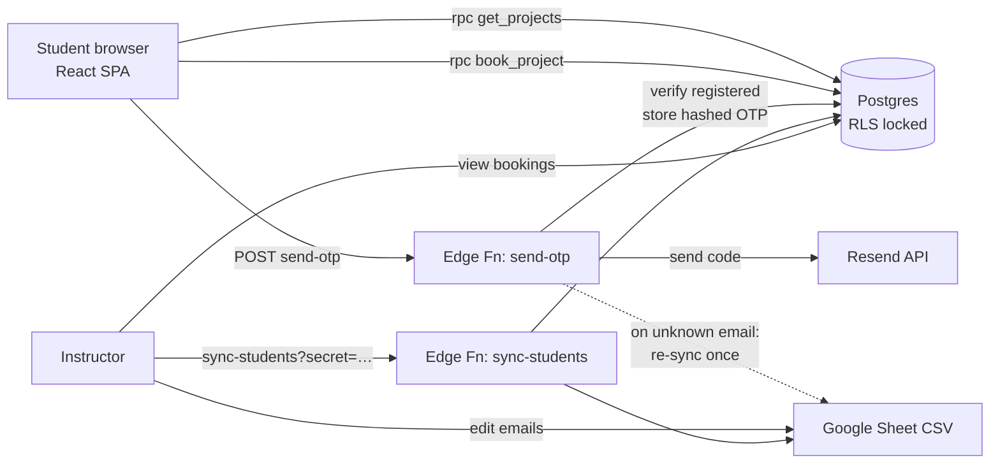
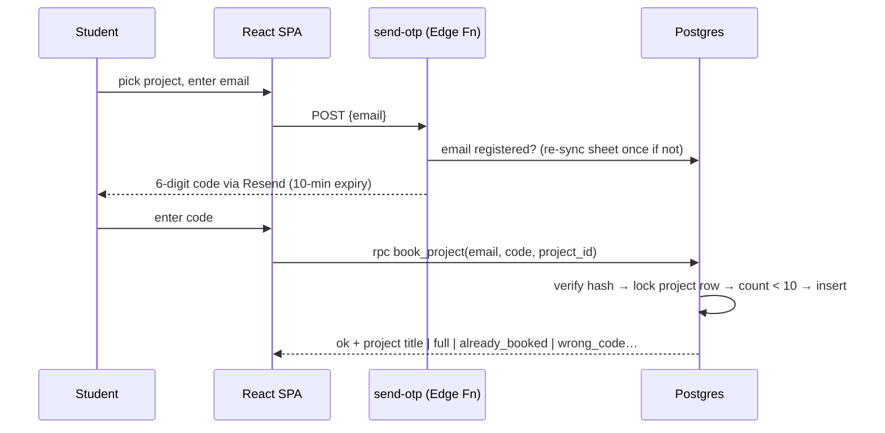

# PRD — Humble Coders Project Booking

**Status:** v1 spec, decisions locked (see Decision Log) · **Owner:** Humble Coders (instructor) · **Date:** 2026-08-17

---

## 1. Overview & Vision

A single-page website, themed to match [humblecoders.in](https://humblecoders.in), where application-development students pick **one of 25 beginner-level Android project ideas** — each built around a freely available public API consumed with Retrofit — and book it for themselves.

The instructor needs seat scarcity (max **10 students per project**) enforced honestly: when many students race for the same project at once, exactly the first 10 win and everyone else gets a clean "full" message. Students must be verifiable as registered course members **without any login/auth system** — verification is a 6-digit code emailed to their registered address.

**Success looks like:** every student books exactly one project with zero instructor intervention, no double-bookings, no overbooked projects, and no disputes about who got a seat.

## 2. Goals & Non-Goals

### Goals (v1)
- Browse all 25 projects with title, brief description, API name + link, key requirement badge, and **live seats-left** count.
- Book a project: email → OTP code via email → confirmed seat. Two steps, under a minute.
- Hard limits enforced server-side: **10 seats per project**, **1 booking per student**, race-condition safe.
- Registered-students list maintained by the instructor in a **Google Sheet** (the only admin surface the instructor touches day-to-day).
- Instructor views/edits bookings via the Supabase dashboard (table editor).

### Non-Goals (v1)
- No accounts, passwords, sessions, or OAuth of any kind.
- No student self-service cancel/switch (instructor deletes a booking row to free a seat). Locked in chat: "one per student", not the changeable option.
- No custom admin dashboard — Supabase's built-in table editor is the admin UI.
- No booking window/deadline logic (open decision, out of v1).
- No payment, waitlists, teams, or multi-course support.

## 3. Users & Roles

| Role | Who | What they do | How they're identified |
|---|---|---|---|
| Student | Registered course member | Browses projects, books exactly one | Email in the registered list + OTP possession |
| Instructor | Humble Coders staff | Maintains email list (Google Sheet), views/undoes bookings (Supabase dashboard), triggers sheet re-sync | Supabase dashboard login; `SYNC_SECRET` for sync URL |

There is no in-product admin role; safety comes from the database only exposing two functions.

## 4. System Architecture

**Stack (locked):** **Vite + React + TypeScript + Tailwind CSS** single-page app (static build, deployed at `projects.humblecoders.in`) + **Supabase free tier** (Postgres, RLS, Edge Functions) + **Resend** (OTP emails) + **Google Sheet published as CSV** (registered-email source of truth). A vanilla-JS prototype exists at `project-booking/index.html` as the behaviour/design baseline.

### Data model

| Table | Columns | Notes |
|---|---|---|
| `students` | `email` PK, `added_at` | Upserted from the Google Sheet |
| `projects` | `id` PK, `title`, `description`, `api_name`, `api_url`, `api_note`, `capacity` (default 10) | Seeded with the 25 ideas (list in `supabase/schema.sql`) |
| `bookings` | `id`, `email` **unique** FK→students, `project_id` FK→projects, `booked_at` | Unique email = one booking per student |
| `otps` | `email` PK, `code_hash`, `expires_at`, `attempts`, `last_sent_at` | SHA-256 hash only, never the plain code |

### Security model (no auth, still safe)
- **RLS on with zero policies** on all tables → the anon key can read/write nothing directly.
- The browser can only call two `SECURITY DEFINER` functions: `get_projects()` (read-only) and `book_project(email, code, project_id)`.
- A booking requires the correct OTP → possession of the inbox → nobody can book with a classmate's email.
- OTP hygiene: hashed at rest, 10-minute expiry, max 5 wrong attempts, 60-second resend cooldown (rate-limited in the edge function).

### Race-condition guarantee (the core correctness requirement)
`book_project` takes `SELECT … FOR UPDATE` on the project row **before** counting seats, serializing all concurrent bookings for that project inside Postgres. 15 simultaneous confirms → exactly 10 inserts, 5 clean `full` errors. The one-booking rule is a DB unique constraint, so it cannot be raced either. **Any reimplementation must preserve these two properties.**

### Booking flow

## 5. Feature Spec by Area

### 5.1 Project catalogue (public page)
- Hero: "Pick Your API Project" + stat pills (25 projects / 10 seats each / 1 per student), dark theme with humblecoders.in tokens (bg `#07090f`, card `#0f131c`, brand `#4263a6`/`#5b7cc4`, gold `#f5c451`, Inter, radius `.875rem`).
- Card per project: `Project NN` chip, key badge (green "No key needed" / gold "Free API key"), title, 1–2 line description, API link (new tab), seat progress bar + "N seats left" (amber ≤3, red/disabled at 0), Book button ("Fully Booked" disabled when full).
- Seat counts refresh every ~45 s and after every booking attempt.
- Fully responsive; works down to 375 px.

### 5.2 Booking modal
- **Step 1:** email input (remembered in localStorage) → "Send Code". Errors: invalid format, `not_registered` (tells them to contact instructor), `too_soon` (60 s cooldown), `email_failed`.
- **Step 2:** 6-digit input (digits only) → "Confirm Booking", resend link with 60 s countdown. Errors: `wrong_code` (+attempts left), `expired`, `too_many_attempts`, `no_code`, `full` (refreshes counts), `already_booked` (shows which project they hold).
- **Step 3:** success state with project name; "already booked" also resolves here informatively.
- Cosmetic "You've booked X" banner from localStorage (server state is the truth).

### 5.3 Student registry (instructor)
- Google Sheet, any layout — anything email-shaped in the published CSV is captured, lower-cased, de-duplicated, upserted (never deletes).
- Auto-sync: `send-otp` re-pulls the sheet once when it sees an unknown email, so adding a student to the sheet is sufficient.
- Manual sync: `GET /functions/v1/sync-students?secret=<SYNC_SECRET>` returns counts.

### 5.4 The 25 projects (content)
Seeded in `supabase/schema.sql`; canonical list with descriptions + API links (all free; mix of "no key" and "free key"): Weather Now (OpenWeatherMap), Currency Converter (Frankfurter), Dictionary (dictionaryapi.dev), Trivia Quiz (Open Trivia DB), Country Explorer (REST Countries), Pokédex Lite (PokéAPI), Recipe Book (TheMealDB), Mocktail Menu (TheCocktailDB), Movie Search (OMDb), News Headlines (NewsAPI), Crypto Tracker (CoinGecko), GitHub Profile Finder, Anime Browser (Jikan), Book Finder (Open Library), NASA APOD, Who's in Space? (Open Notify), SpaceX Launches, Joke Machine (JokeAPI safe-mode), Daily Quotes (ZenQuotes), Advice Generator (Advice Slip), Dog Breed Gallery (Dog CEO), Cat Facts & Pics (TheCatAPI + catfact.ninja), Public Holidays (Nager.Date), University Finder (Hipolabs), Name Predictor (Agify/Genderize/Nationalize).

## 6. Non-Functional Requirements
- **Correctness over everything:** seat caps and one-per-student are DB-enforced; the UI is never the enforcement layer.
- **Scale:** one classroom (~250 students, burst on booking day). Free tiers suffice: Supabase free, Resend 100 emails/day (watch this on booking day — see Open Decisions).
- **Static output:** the Vite build produces plain static files — no server-side rendering, hostable on any static host behind `projects.humblecoders.in`.
- **Responsive on all devices** (375 px phone / 768 px tablet / desktop) is an acceptance criterion for every UI ticket.
- **Secrets** (`RESEND_API_KEY`, `SHEET_CSV_URL`, `SYNC_SECRET`, `FROM_EMAIL`) live only in Supabase edge-function secrets. The anon key is public by design; safety = RLS + the two-function surface.
- **Dependency:** Resend requires `humblecoders.in` domain verification (DNS) before student emails deliver.

## 7. Open Decisions
1. **Resend daily cap** — 100 emails/day free. ~250 students racing on day one could exceed it (each attempt = 1 email). Recommendation: stagger booking opening by batch, or one-time upgrade for booking day.
2. **Booking window** — no open/close date logic in v1. If wanted later: an `opens_at/closes_at` check inside `book_project`.
3. **GitHub repo** — pipeline needs the remote created under the Humble-Coders org (name + visibility TBD by manager).

## 8. Decision Log

| # | Decision | Choice (locked in chat, 2026-08-17) |
|---|---|---|
| 1 | Backend | Supabase free tier (Postgres + RLS + Edge Functions) |
| 2 | Student verification | No auth; 6-digit OTP emailed via **Resend**; "on entering which the database will know who they are" |
| 3 | Registered-email source | **Google Sheet** published as CSV, synced (auto on miss + manual secret URL) |
| 4 | Booking rule | **One project per student**, enforced by unique constraint; no self-service switching |
| 5 | Capacity | 10 seats per project, `capacity` column (editable per project) |
| 6 | Race handling | Inside Postgres: `FOR UPDATE` row lock + count, not app-side |
| 7 | Frontend | Single static `index.html`, no framework, humblecoders.in dark theme |
| 8 | Project count/content | 25 ideas, all free-API + Retrofit focused, seeded in schema |
| 9 | Admin surface | Google Sheet (registry) + Supabase dashboard (bookings); no custom admin UI |

---

*Reference implementation exists at `project-booking/` (schema, both edge functions, page). Tickets should treat it as the spec-compliant baseline to review, harden, deploy — or rebuild against this PRD.*
